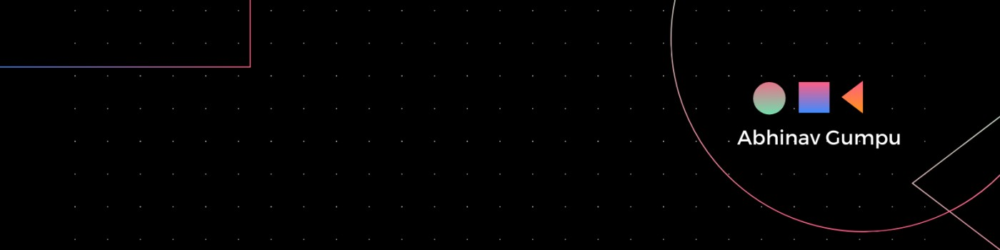

<!-- Intro  -->

<h3 align="center">
        <samp>&gt; Hey There!, I am
                <b><a target="_blank" href="">Abhinav Gumpu</a></b>
        </samp>
</h3>

 
  <samp>
     
    「 I am a full stack web application developer from <b>India</b> 
     
     
  </samp>

 
 

 

## 🧑🏻‍💻 About Me

 

- 🏦 Computer science student at GRIET

- 🌱 I’m currently learning **MERN Stack Development**

- 👨‍💻 All of my projects are available at [Abhinav's workspace](https://github.com/AbhiJay1287?tab=repositories)

- 📫 How to reach me **jayenthg@gmail.com**

## 🛠️ Languages and Tools
         

             

            

    

## ⭐️ My Favourite Repo's 
<table style="border-collapse: collapse; border: 0; width: 100%;">
<tr>
<td>   </td>
<td> </td>
</tr>
</table>

## 🔥 Stats

<table style="border-collapse: collapse; border: 0; width: 100%;">
  <tr>
    <td style="border: 0; padding: 0;">
      
    </td>
    <td style="border: 0; padding: 0;">
      
    </td>
  </tr>
  <tr>
    <td colspan="2" style="border: 0; padding: 0;">
      
    </td>
  </tr>
</table>

<h3 align="left">Connect with me:</h3>

